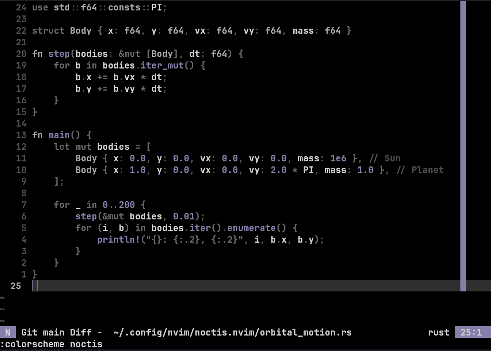

# noctis 🌌

<p align="center">
  
</p>

## Installation

To use **noctis** in Neovim, follow the installation instructions below based on your preferred plugin manager.

### Using [lazy.nvim](https://github.com/folke/lazy.nvim)

Add the following line to your lazy configuration:

```lua
{
    'alejandrolaguna20/noctis.nvim',
    config = function()
        vim.cmd.colorscheme('noctis')
    end,
}
```

Then, run the following in Neovim:

```vim
:Lazy sync
```

Add the line to your `init.vim` or `init.lua` to make it your default theme.

## Credits

This is a fork of [yugen.nvim](https://github.com/bettervim/yugen.nvim)
which is a fork of [poimandres.nvim](https://github.com/olivercederborg/poimandres.nvim)

## Disclaimer

I’m not a professional colorscheme/plugin or Lua developer — this project is the result of a few small tweaks to better suit my style and preferences. Feedback, suggestions, and improvements are always welcome.
